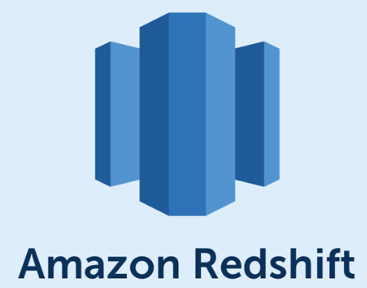
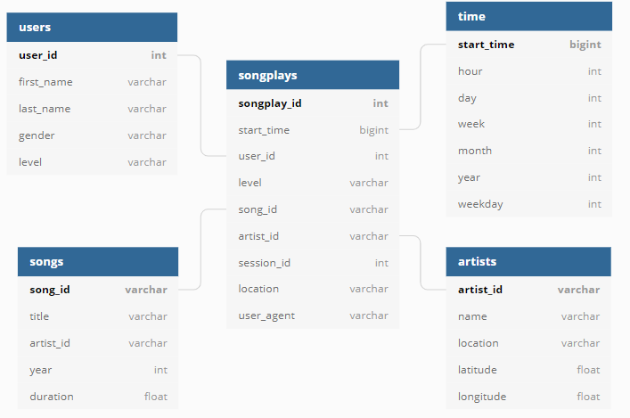
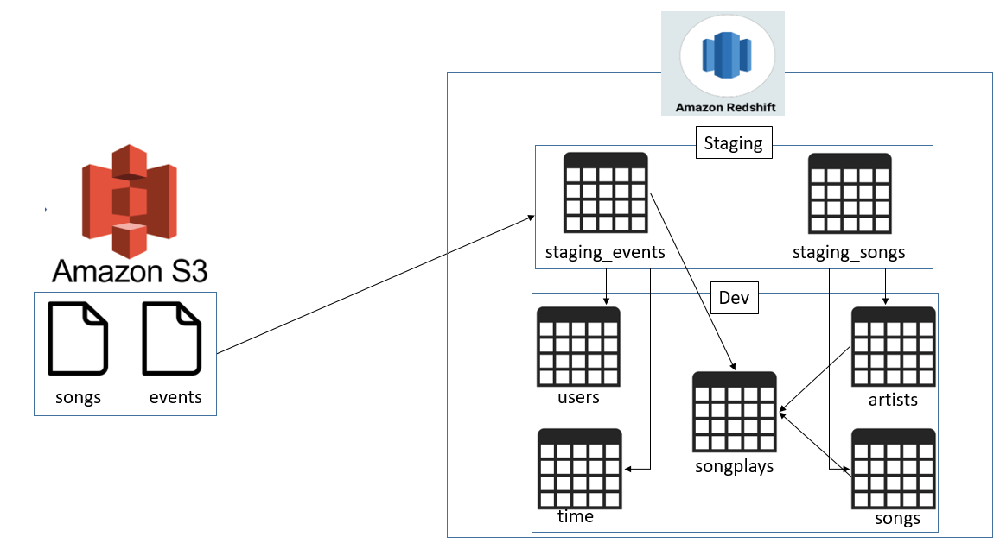

# Sparkify Data Warehouse ETL Pipeline

## Description
---

This repository contains an ETL pipeline to populate the `sparkifydb` database hosted on AWS Redshift.

- The goal of this database is to help Sparkify analyze user behavior — such as the songs users listen to and the artists they prefer — using log and song data.
- This centralized data source supports analytical use cases, such as identifying popular songs or peak hours of user activity.

## Why Redshift?
---

- Amazon Redshift is a fully managed, cloud-based, petabyte-scale data warehouse solution provided by AWS.  
- It offers fast querying capabilities, seamless scalability, and integrates well with other AWS services.
- Redshift is ideal for collecting and storing large volumes of data and running analytical queries via business intelligence tools.



## Database Design
---

- A **Star Schema** is used to simplify queries and allow fast aggregations.
- The `songplays` table is the **fact table**, while other tables serve as **dimension tables** (e.g., `users`, `songs`, `artists`, `time`).



## Data Pipeline Design
---

- The ETL pipeline is developed in Python, leveraging libraries such as `pandas` for data manipulation and `psycopg2` for connecting to Redshift.
- The data sources include:
  - **Song data** (information about songs and artists)
  - **Log data** (user activity)

### ETL Workflow:
1. Load JSON song and log data from Amazon S3 into **staging tables**: `staging_songs_table` and `staging_events_table`.
2. Perform ETL operations to transform and insert data into the final **fact** and **dimension** tables.



## Project Files
---

- `create_tables.py` — Drops existing tables and recreates all necessary tables including staging and final tables.
- `sql_queries.py` — Contains all the SQL queries for table creation and data transformation.
- `etl.py` — Loads data into staging tables, then processes and loads it into the star schema tables.
- `redshift_cluster_setup.py` — Creates the Redshift cluster and IAM roles required for S3 access.
- `redshift_cluster_teardown.py` — Deletes the Redshift cluster and associated IAM roles.
- `dwh.cfg` — Configuration file containing Redshift and AWS settings. Update this file with your specific AWS credentials and cluster details.

## Running the ETL Pipeline
---

1. **Create Tables**
   - Run `create_tables.py` to create the database schema.
   - Existing tables will be dropped and recreated.

   ```bash
   python create_tables.py
